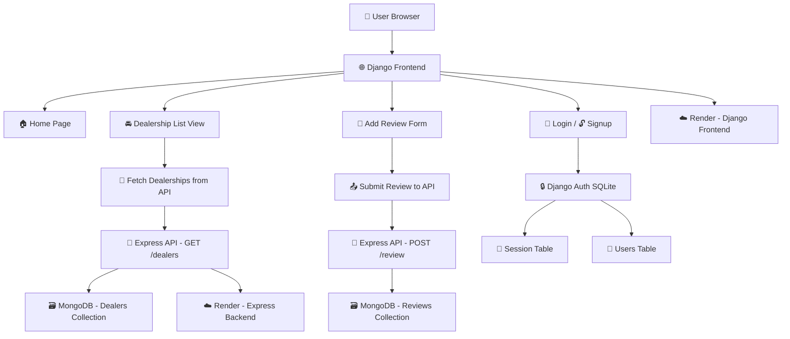

# 🚗 Car Dealership Web Application

> A full-stack car dealership review platform built using **Django**, **Express.js**, and **MongoDB**. This application allows users to browse dealership listings, read and write reviews, and interact with a sleek and responsive interface.

🌐 **Live Demo**

Frontend (Django): [https://car-dealership-application.onrender.com](https://car-dealership-application.onrender.com)

Backend (Express API): [https://car-dealership-express-api.onrender.com](https://car-dealership-express-api.onrender.com)

---

## 🧰 Tech Stack

| Frontend                                                                                       | Backend                                                                                                 | Database                                                                                          |
| ---------------------------------------------------------------------------------------------- | ------------------------------------------------------------------------------------------------------- | ------------------------------------------------------------------------------------------------- |
|  |  |  |

---

## 📝 About the Project

This project simulates a **Car Dealership Review System**, where users can:

* 🔍 Explore a list of car dealerships.
* 📄 View dealership details.
* ✍️ Submit reviews and ratings.
* 🔐 Register and log in to post reviews.
* 💬 Interact with a seamless and clean UI.

The frontend is handled by **Django**, which fetches data from a separately hosted **Express API**. This API interacts with a **MongoDB Atlas** database to store dealership and review data.

---

## ⚙️ Architecture Overview


---

## 📁 Project Structure

```plaintext
capstone-project/
├── express-server/              # Express.js backend
│   ├── routes/                  # API routes
│   ├── models/                  # Mongoose models
│   ├── db.js                    # DB connection
│   ├── seed.js                  # Sample data script
│   └── server.js                # Entry point
│
├── server/                      # Django frontend
│   ├── capstone_project/        # Settings, URLs
│   ├── dealership/              # Views, models, templates
│   └── static/                  # CSS, JS, images
│
└── .github/workflows/           # CI/CD workflows
```

---

## 🚀 Getting Started Locally

### 🔧 Backend Setup (Express.js)

```bash
cd express-server
npm install
node seed.js         # Seeds sample data to MongoDB
node server.js       # Runs at http://localhost:3000
```

### 🌍 Frontend Setup (Django)

```bash
cd ../server
python -m venv venv
source venv/bin/activate        # or venv\Scripts\activate on Windows
pip install -r requirements.txt

python manage.py makemigrations
python manage.py migrate
python manage.py runserver      # Runs at http://localhost:8000
```

---

## 🧪 Features

* 🔒 User Authentication (Login, Signup, Logout)
* 🗂 View All Car Dealerships
* 📖 View Dealership Details and Past Reviews
* ✍️ Add New Reviews via Form (POST to Express API)
* 🛰 Integration with External REST API
* 🎨 Responsive TailwindCSS UI

---

## 📦 Deployment Details

| Component       | Platform | URL                                                                                                |
| --------------- | -------- | -------------------------------------------------------------------------------------------------- |
| Django Frontend | Render   | [https://car-dealership-application.onrender.com](https://car-dealership-application.onrender.com) |
| Express API     | Render   | [https://car-dealership-express-api.onrender.com](https://car-dealership-express-api.onrender.com) |
| MongoDB         | Atlas    | Private                                                                                            |

---

## 🛠️ Future Improvements

* 📱 Mobile Responsiveness
* 🔍 Add search & filter for dealerships
* 📊 Admin dashboard for managing reviews
* ⭐️ Rating system visualization (e.g. star icons)
* 📬 Email verification and reset password

---

## 👨‍💻 Developed By

**John Wesley**

Full Stack Web Developer & UI/UX Designer

📧 [johnwesley8113@gmail.com](mailto:johnwesley8113@gmail.com)

🔗 [LinkedIn](https://linkedin.com/in/john-wesley-6707ab258)

